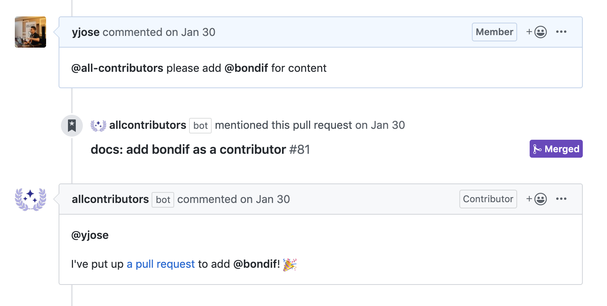
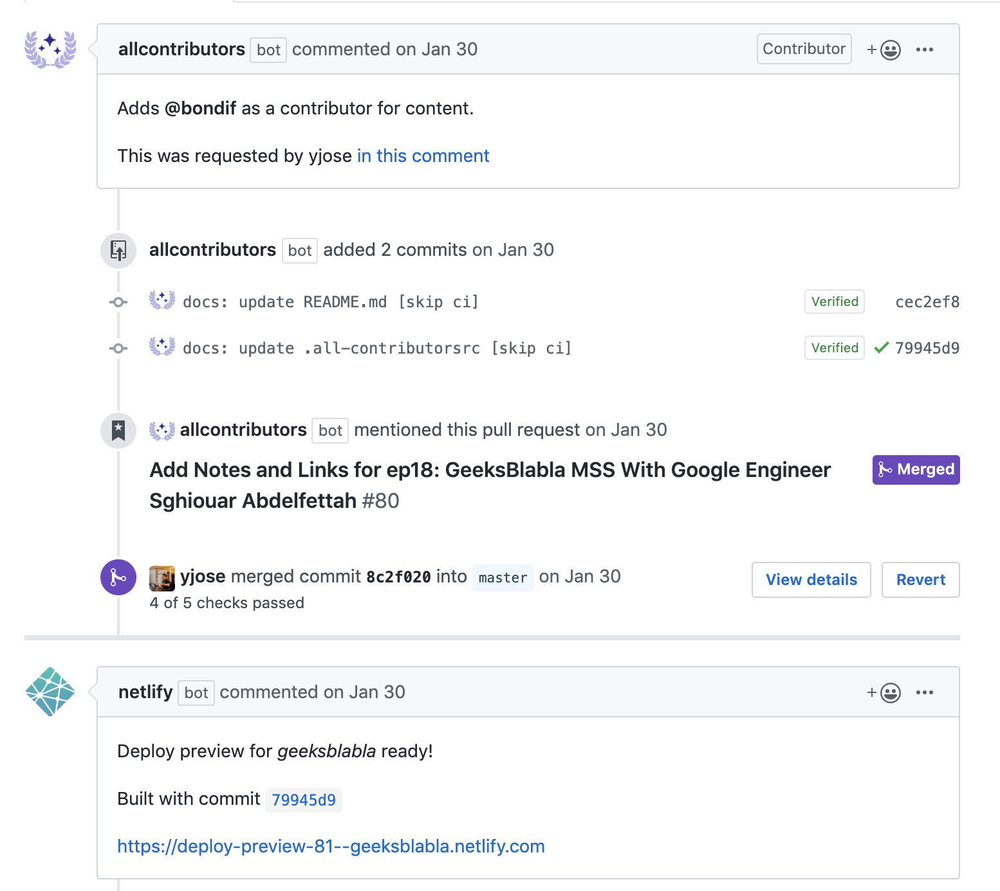

Today I am sharing my journey developing a new Geeksblabla feature. Meanwhile, I think it would be the perfect way to share my passion using GatsbyJs and how I can always find a solution for my challenges using GatsbyJs APIs. This article is a GatsbyJs showcase on how we can add a contributors list to any community project website.

In the last couple of weeks, we started working on updating our Geeksblabla website design and adding some new features. During our design process, we came up with this idea to thank our wonderful project contributors by making a contributors section on the main website. We think this kind of credit will encourage the community members to contribute As they will see their names as part of the contributors' family.

> [GeeksBlabla](https://geeksblabla.com/) is one of the [DevC Casablanca](https://www.facebook.com/groups/DevC.Casablanca/) community products. It's 3 to 5 people show talking about a specific dev topic or interviewing a successful Moroccan person in IT. Briefly, it's a Geeks blabla.

> we agree that adding a new feature to the project should be easy to maintain and handle by anyone of the team without any issues.

# The Approach

GeeksBlabla source code is hosted on GitHub under the DevC Casablanca organization. It's public, so everyone can contribute to the project.

To Make a list of all contributions we are going to implement the all-contributors project that comes with a great Github bot that helps to add people using a GitHub comment.

The all-contributors spec will create a `.all-contributorsrc` JSON format file in the project root with all contributors, the idea is to create a GatsbyJs resource from this file and use it as a graphQl query for our contributors section component. And to automate the workflow, we are going to setup all-contributors GitHub bot that we can trigger any time using GitHub comment.


# Setup All-Contributors

[All-Contributors](https://allcontributors.org/) is a specification for recognizing contributors to an open-source project in a way that rewards each and every contribution, the tool also provides an emoji key to determine the contribution type (code, design, content….)

With All-contributors we have two options to add contributors: CLI to init the project and a smart GitHub bot to automate the process of adding new contributors using GitHub comment.

To Get Started, we need to Install `all-contributors` CLI as development dependency for our project:

```bash
yarn add --dev all-contributors-cli # or npm
```

Then we need to init the all-contributors spec using init command:

```bash
yarn all-contributors init
```

This command asks a few questions and sets up the project for all-contributors. This setup includes creating a `.all-contributorsrc` configuration file and creating a contributor table in the files you specify, a README file in our case.

Now we can start adding contributors to our list by running the following command where username is the user's GitHub username, and contribution is a,-separated list of contributions.

```bash
#all-contributors add <username> <contribution>

all-contributors add yjose code,design
```

If everything goes as expected you should see a new `.all-contributorsrc` file in the project root with your contributor’s list :

```json
{
  "projectName": "geeksblabla.com",
  "projectOwner": "DevC-Casa",
  "repoType": "github",
  "repoHost": "https://github.com",
  "files": ["README.md"],
  "imageSize": 180,
  "commit": false,
  "commitConvention": "none",
  "contributors": [
    {
      "login": "yjose",
      "name": "Youssouf EL AZIZI",
      "avatar_url": "https://avatars0.githubusercontent.com/u/11137944?v=4",
      "profile": "https://elazizi.com",
      "contributions": ["code", "doc", "content", "review"]
    },
    {
      "login": "Amine-H",
      "name": "Amine Hakkou",
      "avatar_url": "https://avatars1.githubusercontent.com/u/6276978?v=4",
      "profile": "https://hakkou.me",
      "contributions": ["code", "content"]
    },
    {
      "login": "souffanda",
      "name": "Soufian El ",
      "avatar_url": "https://avatars2.githubusercontent.com/u/24813026?v=4",
      "profile": "https://github.com/souffanda",
      "contributions": ["code", "doc", "content", "ideas"]
    }
    //......
  ],
  "contributorsPerLine": 5
}
```

> Learn more about all-contributor cli 👉 [link](https://www.gatsbyjs.org/docs/creating-a-source-plugin/)

# Create allContributors source

A GatsbyJs source is the simplest version of a source plugin that is essentially out of the box integration between Gatsby and various third-party systems such as file-source-plugin to pull data into your Gatsby application from a local filesystem. In our case We are going to use Gatsby’s source to bring All-contributors file data to the Gatsby system then we can transform it to create our nodes that can be fetched as graphQl data.

To create a new source we need to export `sourceNodes` function from our `gatsby-node.js` file.

First, we load the data from `.all-contributorsrc` file using node filesystem API.Then, we parse the data using the JSON built-in API as we know that `.all-contributorsrc` is a JSON format.
Our last step is to create a new node for every contributor using GatsbyJs node API.

```js
//gatsby-node.js
const fs = require("fs");
// ....
exports.sourceNodes = async ({
  actions,
  createNodeId,
  createContentDigest
}) => {
  let data = JSON.parse(fs.readFileSync("./.all-contributorsrc", "utf-8"));

  data.contributors.forEach(contributor => {
    const node = {
      ...contributor,
      id: createNodeId(`contributor-${contributor.login}`),
      internal: {
        type: "Contributor",
        contentDigest: createContentDigest(contributor)
      }
    };

    // Create the actual data node
    actions.createNode(node);
  });
};
```

> Learn more on how to create a Gatsby source plugin 👉 [link](https://www.gatsbyjs.org/docs/creating-a-source-plugin/)

Restart the server and if everything works as expected you should see the `allContributor` query in the graphQl playground with the correct contributor’s list.


> GraphQl Playground

# Create All contributors Component

The Above GraphQl playground comes up with a great utility called **Code Exporter** which generates a snippet for our GraphQl query with the correct imports.

We are going to create a `Contributor` component that can be used to display all contributors in our root component like the following.

```js
// Contributors.js
import React from "react";
import { useStaticQuery, graphql } from "gatsby";
import Contributor from "./Contributor";

const contributorsQuery = graphql`
  {
    allContributor {
      edges {
        node {
          id
          login
          name
          profile
          avatar_url
          name
        }
      }
    }
  }
`;

export default () => {
  const data = useStaticQuery(contributorsQuery);
  const contributors = data.allContributor.edges;
  return (
    <div className="contributors">
      <div className="container list">
        {contributors.map(({ node: { id, ...node } }) => (
          <Contributor {...node} key={id} />
        ))}
      </div>
    </div>
  );
};
```

# Setup all-contributor Github bot

First, go to [this link](https://github.com/apps/allcontributors/installations/new) to install All-contributors bot in your project repo,Then make sure to follow the [installation steps](https://allcontributors.org/docs/en/bot/installation). Once Done, You can comment on issue or pull request and ask @all-contributors to add a contributor using the following format:

```bash
# @all-contributors please add <username> for <contributions>
@all-contributors please add yjose for content

```

# Workflow in Actions

To see the workflow in Actions, We are Going to choose a contribution from Mohamed (@bondif) and try to make sure the Workflow works as Expected:

**Step 1** : Comment to pull Request and ask @all-Contributor to add @bondif to the contributors’ list. @all-contributor bot will reply to my comment with a link to the new PR.



> Step1

**Step 2** : Netlify preview will deploy a preview version of our website. We just need to Make sure our new contributor has been added to the contributors’ section.



> Step1

**Step 3** : Done! PR Merged 😄.


Thanks for reading! I hope you found it interesting, informative, and entertaining. If you think other people should read this post, Make sure to tweet, share and [follow me](https://twitter.com/ElaziziYoussouf) for upcoming stories.
