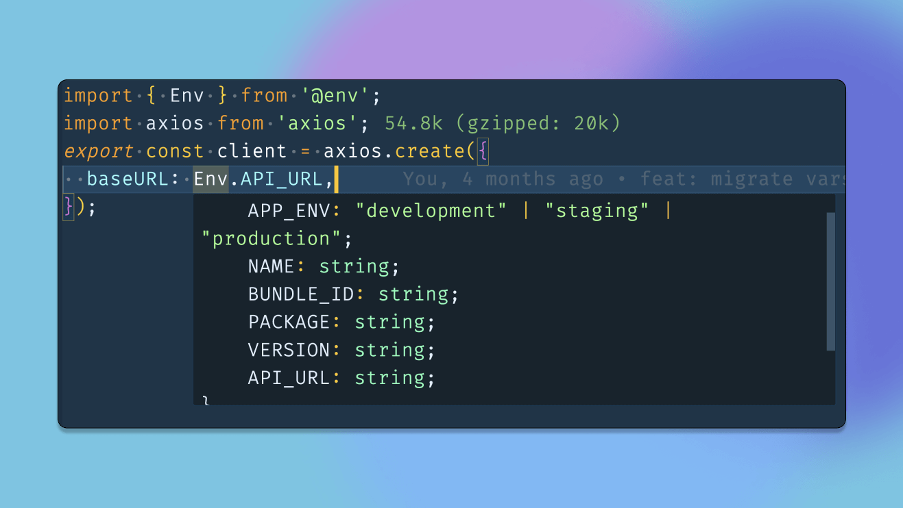

Managing environment variables in React Native is crucial for any project and can be sometimes tricky, and people tend to get lost with all the options available out there. Do I need to use native packages or just load them using a Babel plugin? What about security, and how can I handle different environments like staging and production?

I have been there before and managed to find my way out of it, and today I will share with you how to do it the right way.

I know that **the right way** is a bold statement, but let's agree first on what **the right way** means while managing environment variables in React Native.

For me, the right approach should have the following:

- **Easy**: It should be straightforward to add new variables and use them in the code.
- **TypeScript Support**: It should support typing with TypeScript so we can make sure we have autocomplete and type checking.
- **Build Time Validation**: It should be validated at build time to make sure all the variables are set and give a clear error message if not.
- **Multiple Environments Support**: It should support multiple environments like staging and production and make it easy to switch between them.
- **Secure**: Environment variables should be secure.

I would assume we all agree on the above points, and if you have any other points, please let me know in the comments below.

Before we start, the approach is heavily based on Expo, so if you are not using Expo, or the Expo Dev Client with your app, you might need to do some tweaks to make it work. And most importantly, you are missing out on a lot of cool features, my friend, if you are not using Expo. I cannot find a reason why you are not using Expo, especially after the release of the Expo Dev Client, which gives you the best of both worlds.

Now let's see if we can make it and start coding.

## Table of Contents

## Step 1: Install the Required Packages and Create `.env` Files

First, we need to install the two packages:

- [`dotenv`](https://github.com/motdotla/dotenv): to load the environment variables from the `.env` file.
- [`Zod`](https://zod.dev/): validation library to validate the environment variables.
- [`expo-constants`](https://docs.expo.dev/versions/latest/sdk/constants): to get the `expoConfig` object from the `app.config.ts` file.

```bash
yarn add dotenv zod
npx expo expo-constants
```

Next, we need to create the `.env` files for each environment we have. For example, if we want multiple variants for staging and production, we need to create the following files:

```bash
.env.development
.env.staging
.env.production
```

For the sake of simplicity, let's assume we have only two variables in our `.env` files: `API_URL`, `BUNDLE_ID` and `SENTRY_TOKEN` to upload the source maps to Sentry.

```bash
# .env.staging
BUNDLE_ID=com.example.app.staging
API_URL=https://qa-api.example.com
SENTRY_TOKEN=https://sentry.io/123456
```

> Other files should have the same variables with different values.

## Step 2: Create `env.js` File

To handle all logic related to environment variables, we are going to create a file called `env.js` at the root of our project.

> 💡 You may be wondering why we are not using the `.ts` extension for the `env.js` file. At the time of writing this article, you cannot import `.ts` files into the `app.config.ts` file and we plan to include it into `app.config.ts` later in the process.
>
> ⚠️ Please let me know in the comments below if you know how to do it or if I am messing something.

### Part 1: Load the correct `.env` file

```js
const z = require("zod");

const path = require("path");
const APP_ENV = process.env.APP_ENV ?? "development";
const envPath = path.resolve(__dirname, `.env.${APP_ENV}`);

require("dotenv").config({
  path: envPath,
});
```

To load the correct file, we use an inline variable environment called `APP_ENV` and set it to `development` by default. Then, we use the `dotenv` package to load the correct `.env` file based on the `APP_ENV` value.

Normally, the `APP_ENV` variable should be passed to the app while running npm scripts, like the following:

```json
{
  "scripts": {
    "start": "APP_ENV=development expo start",
    "start:staging": "APP_ENV=staging expo start",
    "build:production": "APP_ENV=production expo start"
  }
}
```

So, for example, running `yarn start:staging` will load the `.env.staging` file and we can access the variables using `process.env.VAR_NAME`.

### Part 2: Create a `schema` to validate the environment variables

To validate the environment variables, we are going to use the `Zod` package. If you are not familiar with it yet, Zod is a TypeScript-first schema validation with static type inference. People use it to validate forms, API responses, and here we are going to use it to validate the environment variables.

Zod helps you define a schema for your objects and validate them. If the object does not match the schema, it throws an error or returns `false` in case you use the `safeParse` function. It's as simple as that.

> 💡 if you are not familiar with zod validation I recommend watching this quick video: [Zod Goes Where TypeScript Can't](https://www.youtube.com/watch?v=o4h8PUVy5J8)

Let's see how we can use it to validate our environment variables.

```js
// env.js
const z = require("zod");

// ... the code above

// creating the schema
const client = z.object({
  APP_ENV: z.enum(["development", "staging", "production"]),
  API_URL: z.url(),
});

const buildTime = z.object({
  SENTRY_TOKEN: z.string(),
  BUNDLE_ID: z.string(),
});

// Get the environment from the process

/**
 * @type {Record<keyof z.infer<typeof client> , string | undefined>}
 */
const _clientEnv = {
  APP_ENV,

  // ADD YOUR ENV VARS HERE TOO
  API_URL: process.env.API_URL,
};

/**
 * @type {Record<keyof z.infer<typeof buildTime> , string | undefined>}
 */
const _buildTimeEnv = {
  // ADD YOUR ENV VARS HERE TOO
  SENTRY_TOKEN: process.env.SECRET_KEY,
  BUNDLE_ID: process.env.BUNDLE_ID,
};
```

As you can see in the code above, we create two schemas: `client` and `buildTime`. In the `client` schema, you need to define all variables that you want to access in the `src` folder, and for the `buildTime` schema, you need to define all variables that you want to access only in the `app.config.ts` file.
For example, we only need the `SENTRY_TOKEN` in the `app.config.ts` file to upload the source maps to Sentry, so we add it to the `buildTime` schema.

Then we need to create two objects for our variable environment: `_clientEnv` and `_buildTimeEnv` and load the variables from the `process.env` object.

As you may notice, we are using the `z.infer` utility to get the type of the schema and use it as type annotation for `_clientEnv` and `_buildTimeEnv` objects. This way, we can get typing errors if you missed any variable directly from the editor.

> ⚠️ Make sure you have `"checkJs": true` in your `tsconfig.json` file

### Part 3: Validate the environment variables & Error handling

Now we have the schemas and the environment variables, we can validate them using the `safeParse` function from the `Zod` package.

```js
// env.js
const z = require("zod");

// ... the code above

// we merge all variables into one object
const _env = {
  ..._clientEnv,
  ..._buildTimeEnv,
};

// merge the two schemas
const merged = buildTime.merge(client);
const parsed = merged.safeParse(_env);

if (parsed.success === false) {
  console.error(
    "❌ Invalid environment variables:",
    parsed.error.flatten().fieldErrors,

    `\n❌ Missing variables in .env.${APP_ENV} file, Make sure all required variables are defined in the .env.${APP_ENV} file.`,
    `\n💡 Tip: If you recently updated the .env.${APP_ENV} file and the error still persists, try restarting the server with the -cc flag to clear the cache.`
  );
  throw new Error(
    "Invalid environment variables, Check terminal for more details "
  );
}

const Env = parsed.data;
const ClientEnv = client.parse(_clientEnv);

module.exports = {
  Env,
  ClientEnv,
};
```

We first merge two schemas into one, called `merged`. Then, we use the `safeParse` function to validate the environment variables. We check if the validation was successful by looking at the `parsed.success` property. If it's `false`, we log an error with a helpful message and throw an exception.

If the validation was successful, we export the `Env` and `ClientEnv` objects. `Env` represents all environment variables, and `ClientEnv` represents the variables that we can access in the `src` folder.

## Step 3: Load `env.js` file in `app.config.ts`

Now that we have the `env.js` file ready, we can load it into the `app.config.ts`` file and use it to configure the app.

```ts
import type { ConfigContext, ExpoConfig } from "@expo/config";

import { ClientEnv, Env } from "./env";

export default ({ config }: ConfigContext): ExpoConfig => ({
  ...config,
  name: "MyApp",
  // ... the rest config
  ios: {
    bundleIdentifier: Env.BUNDLE_ID,
  },
  extra: {
    ...ClientEnv,
  },
});
```

We can easily import `Env` and `ClientEnv` objects from `env.js` and use them to configure the app. This approach allows us to run multiple versions of the app with different settings, only based on the `.env` files.

The good part here is when we run any expo command such us `expo start`, `expo prebuild` or `expo ios` the `env.js` file will be loaded first and the validation will be executed before the app starts. and we will get an error like the following if we missed adding any variable.

```bash
❌ Invalid environment variables: { API_URL: [ 'Required' ] }
❌ Missing variables in .env.development file, Make sure all required variables are defined in the .env.development file.
💡 Tip: If you recently updated the .env.development file and the error still persists, try restarting the server with the -cc flag to clear the cache.
```

To make sure our app is available in the run time we need to pass the `ClientEnv` object to the `extra` property in the `app.config.ts` file. This way, we can access the variables in the `src` folder using the `Constants.expoConfig.extra` object.

Maybe you are asking yourself, why we should pass the `ClientEnv` object to the `extra` property? Why not import the `env.js` file directly in any file inside the `src` folder?

The answer is simple, we can't import the `env.js` file directly in the `src` folder because we are using `dotenv` and `path` module inside `env.js` file, those modules are node modules and can't be used with react native runtime. so importing the `env.js` file directly in the `src` folder will throw an error.

Another important reason is that accessing the environment variables with an `extra` property will give us an extra layer of security, as our environment variables will not be added as raw text in the JavaScript bundle file.

## Step 4: Access the environment variables in the `src` folder

We know that we can access the environment variables in the `src` folder using the `Constants.manifest.extra` object. But the downside of this approach is that we lose TypeScript support, as the `Constants.expoConfig.extra` object is not typed. So, let's fix this with this simple trick.

Go to the `src` folder and create a new file called `env.js` and add the following code.

```js
// src/env.js
/*
 * This file should not be modified; use `env.js` in the project root to add your client environment variables.
 * If you import `Env` from `@env`, this is the file that will be loaded.
 * You can only access the client environment variables here.
 * NOTE: We use js file so we can load the client env types
 */

import Constants from "expo-constants";
/**
 *  @type {typeof import('../../env.js').ClientEnv}
 */
//@ts-ignore // Don't worry about TypeScript here; we know we're passing the correct environment variables to `extra` in `app.config.ts`.
export const Env = Constants.expoConfig?.extra ?? {};
```

As you can see, this file only exports the `Constants.expoConfig.extra` object. But the interesting part here is that we are using type annotations to get the type of the `ClientEnv` object from the `env.js` root file. This way, we can get typing support for the `Env` object without importing `env.js` root file directly.

> ⚠️ Make sure you have `"checkJs": true` in your `tsconfig.json` file

You can now import the `Env` object from `src/env.js` and use it to access environment variables. To make it easier, add a resolver for this file to `tsconfig.json` and babel configuration so you can import environment variables with `import { Env } from '@env'`.

```json
// tsconfig.json
{
  "extends": "expo/tsconfig.base",
  "compilerOptions": {
    "strict": true,
    "baseUrl": ".",
    "paths": {
      "@env": ["./src/env.js"]
    },
    "esModuleInterop": true,
    "checkJs": true
  }
}
```

```js
// babel.config.js
module.exports = function (api) {
  api.cache(true);
  return {
    presets: ["babel-preset-expo"],
    plugins: [
      [
        "module-resolver",
        {
          root: ["./"],
          alias: {
            "@env": "./src/env.js",
          },
          extensions: [
            ".ios.ts",
            ".android.ts",
            ".ts",
            ".ios.tsx",
            ".android.tsx",
            ".tsx",
            ".jsx",
            ".js",
            ".json",
          ],
        },
      ],
    ],
  };
};
```

Congratulations! You can now access environment variables in the `src` folder with TypeScript support.
and here is a simple example:

```tsx
// src/api/client.ts
import { Env } from "@env";
import axios from "axios";
export const client = axios.create({
  baseURL: Env.API_URL,
});
```

## Real-world example

if you want to see a real-world example of how to use this approach, you can check the following files in our [react-native-obytes-template](https://github.com/obytes/react-native-template-obytes). (Make sure to give it a star ⭐️)

- [📄 env.js](https://github.com/obytes/react-native-template-obytes/blob/master/env.js)
- [📄 app.config.ts](https://github.com/obytes/react-native-template-obytes/blob/master/app.config.ts)
- [📄 src/core/env.js](https://github.com/obytes/react-native-template-obytes/blob/master/src/core/env.js)
- [📄 tsconfig.json](https://github.com/obytes/react-native-template-obytes/blob/master/tsconfig.json)
- [📄 babel.config.js](https://github.com/obytes/react-native-template-obytes/blob/master/babel.config.js)
- [📄 src/api/client.ts](https://github.com/obytes/react-native-template-obytes/blob/master/src/api/common/client.tsx)

## Last words

I know it's a long article, but I hope you find it useful. and before ending this article I want to add some notes.

- Probably we didn't talk that much about how secure this approach is? And the answer is that we did our best by accessing the environment variables through the `extra` property, but it's **not 100% secure**. So if you have critical keys, make sure to put them on the server side.

- The new version of Expo will automatically load the `.env` file, which probably means that we won't need to use the `dotenv` module to load the file anymore. However, I'm not sure how this will affect this approach. Please let me know in the comments if you have more details about this.

- This approach is inspired by [T3 Stack](https://create.t3.gg/) and want to thank them for their great work.

- I shared this approach here to get your feedback and improve it, so please let me know in the comments if you have any suggestions.

**Happy coding 🚀**
