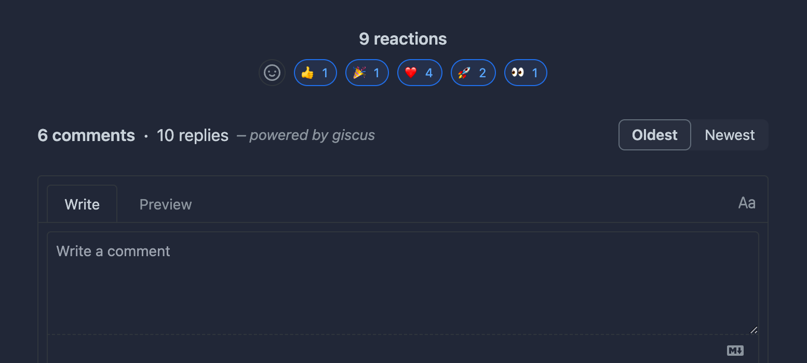

Adding a comments section to your blog posts is an excellent way to receive feedback from readers and gather additional ideas for improving your writing and approaches.

However, adding a comments system can be a little challenging if you are using a static site generator like Astro, where your content is primarily hosted in Markdown files within a Git repository.

If you use Astro for your blog and want to add comments to your posts, this guide will demonstrate how you can use the Giscus app to make it ready in a few minutes.

> **Note**: If you're interested in adding more interactive features to your blog, check out my article on [how to add a views counter to your Astro blog posts](/posts/add-views-counter-to-your-astro-blog-posts)!

## Table of Content

## 👀 What is Giscus

[Giscus](https://giscus.app/) is a comment system powered by GitHub Discussions that allows visitors to leave comments and reactions on any website via GitHub! It's free and doesn't require any database or authentication system. All your comments will be stored in GitHub Discussions, giving you full control over your data.

## ⚙️ Create a Giscus configuration for your website

First, make sure the Discussions feature is enabled on your GitHub repository. (Your blog's GitHub repository should be public.)

Create a new category called `Blog Post Comments` for discussions on comments. Ensure that the category is set to `Open-ended discussion.`


Now, go to [giscus.app](https://giscus.app/) and enable the Giscus bot for your repository. This bot will automatically create a discussion the first time someone leaves a comment or reaction after GitHub authentication.

After enabling the bot, add your repository to the website. If all criteria are met, you will see a success message, similar to the one below.


Make sure to select the `Discussion title contains page URL` option for mapping the embedding page and the embedded discussion.

The last options is to configure the discussion category, the appearance, and the loading approach:

- For the category, select the category you created earlier: `Blog Post Comments.`
- For the appearance, choose the `Transparent Dark` theme. (You can explore other options that match your website theme, but I personally found this one to be the best as I use a dark theme for my blog.)
- For the loading approach, choose `Lazy` to load the comments only when the user scrolls to the comments section.


At the end, you will get a snippet that you can add to your website.

```html
<script
  src="https://giscus.app/client.js"
  data-repo="username/repo"
  data-repo-id="repo-id"
  data-category="Blog Posts Comments"
  data-category-id="DIC_kwDOB3LMn84CaXpn"
  data-mapping="url"
  data-strict="0"
  data-reactions-enabled="1"
  data-emit-metadata="0"
  data-input-position="bottom"
  data-theme="preferred_color_scheme"
  data-lang="en"
  data-loading="lazy"
  crossorigin="anonymous"
  async
></script>
```

## 🔥 Add Giscus to your Astro blog

Now that you have your Giscus configuration ready, let's create a component called `PostComments` and add the snippet to it.

```js
//Path: src/components/PostComments.astro
<section class="giscus mx-auto mt-10 w-full"></section>

<script
  src="https://giscus.app/client.js"
  data-repo="username/repo"
  data-repo-id="repo-id"
  data-category="Blog Posts Comments"
  data-category-id="DIC_kwDOB3LMn84CaXpn"
  data-mapping="url"
  data-strict="0"
  data-reactions-enabled="1"
  data-emit-metadata="0"
  data-input-position="bottom"
  data-theme="preferred_color_scheme"
  data-lang="en"
  data-loading="lazy"
  crossorigin="anonymous"
  async
></script>
```

Now, let's import the component into our blog post layout and add it to the bottom of the page.

```js
//Path: src/layouts/PostDetails.astro

---
import Layout from "@layouts/Layout.astro";
import Footer from "@components/Footer.astro";
import PostComments from "@components/PostComments.astro";

---

<Layout>
  <main id="main-content">
    <article
      id="article"
      role="article"
      class="prose mx-auto mt-8 max-w-3xl prose-pre:border-[1px] prose-pre:border-skin-line prose-pre:border-solid"
    >
      <Content />
    </article>
    <PostComments />
  </main>
  <Footer />
</Layout>
```

Done! Congratulations 🚀 You now have a comments section on your Astro blog.

Do you want to try it out? Leave a comment below and let me know what you think. 😀
