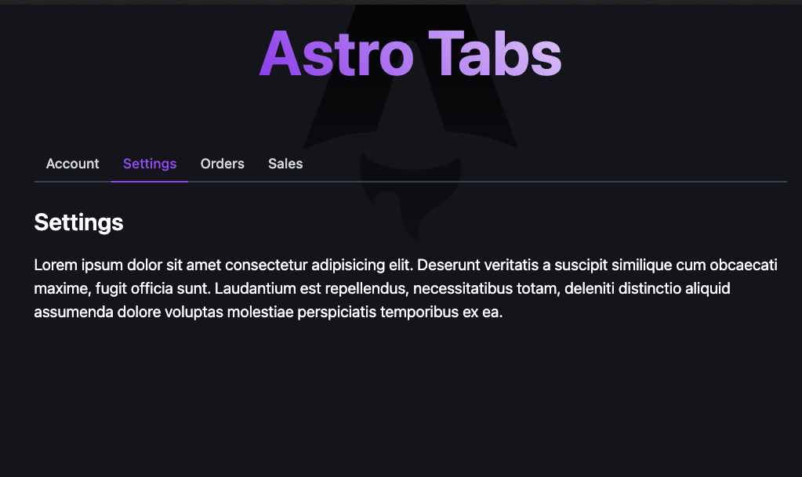

During a recent project migration from Gatsby to Astro, I needed to implement a tabs component that was previously used in our Gatsby markdown files. The process went smoothly, and I decided to document my experience in this article to share it with you.

Initially, I considered simply copying the React tabs component from the old project and using it in the new Astro project. This is one of Astro's strengths, as it allows the use of almost any frontend library. However, I decided to explore other possible solutions, thinking it might be a good opportunity to learn something new.

Using React to implement our tabs component would necessitate the use of `client:load` since the component is interactive. This approach would load and hydrate the component on the client side, potentially impacting the website's performance. Therefore, I began exploring alternative solutions to ensure our website remains as fast as possible.

One of the main reasons I love using Astro and have adopted it for most of my side projects is its flexibility. Astro enables seamless integration with almost any frontend library or even pure vanilla JavaScript, offering a wide range of options without any constraints.

> Show me the code, enough talking 😀

Sure, let's dive into the code.

Our solution involves using a custom web component. Interestingly, I first heard about web components a few years ago but never had the opportunity to use them in a real project. I suspect this might be the case for many of us. (Feel free to share your experiences in the comments.) Now, it's finally time to add web components to my resume.

Our component will be a simple wrapper around tabs from [lion](https://lion-web.netlify.app/components/tabs/overview/) web components library. you can think of it as `radix-ui` for web components. it provides a set of unstyled web components that you can use to build your own design system.

First, let's install the tabs web component.

```bash
npm install @lion/web-components
```

Then let's create our `Tabs` and `TabItem` components.

```astro title="src/components/Tabs.astro"
<lion-tabs>
    <slot />
</lion-tabs>

<script>
  import '@lion/ui/define/lion-tabs.js';
</script>

```

The process is quite simple. We import the tabs component from `@lion/ui/define/lion-tabs.js` and wrap our content within it. If you're new to Astro, think of the slot as the equivalent of the React children prop.

Next, let's create a `TabItem` component to encapsulate the content of each tab. This involves defining the `tab` and `panel` slots using the `slot` attribute, as demonstrated in the code below. This setup allows us to easily manage and style the tab headers and their corresponding content panels.

```astro title="src/components/TabItem.astro"
---

export interface Props{
  title: string
}

const { title = 'title' } = Astro.props;
---


<button slot="tab"  class="inline-flex whitespace-nowrap border-b-2 border-transparent py-2 px-3 text-sm font-medium text-gray-300 transition-all duration-200 ease-in-out hover:border-b-[#9249ed] hover:text-[#9249ed] aria-selected:border-b-[#9249ed] aria-selected:text-[#9249ed]"> {title} </button>
<div slot="panel" class="border-t-2 border-gray-700 pt-6 -mt-[2px]">
  <slot />
</div>

```

Our component is now ready to be used. Here's an example of how you can integrate it into your markdown or any other Astro component.

```astro title="src/pages/index.astro"
---
import Tabs from '../components/Tabs.astro'
import TabItem from '../components/TabItem.astro'
---

<Tabs>
  <TabItem title="Account">
    <p>This is the content of Account</p>
  </TabItem>
  <TabItem title="Settings">
    <p>This is the content of Settings</p>
  </TabItem>
  <TabItem title="Sales">
    <p>This is the content of Sales</p>
  </TabItem>
</Tabs>

```

And this is the result 👇

<iframe src="https://stackblitz.com/edit/withastro-astro-ufa4hp?embed=1&file=src%2Fpages%2Findex.astro&hideExplorer=1&theme=dark&view=preview" width="100%" height="790px" frameBorder="0" style="border: 0;"></iframe><br>Brought to you by <a href="" target="_blank"></a>

That's it! I hope you enjoyed this article. Make sure to share it with your network so that other people can benefit from it as well. If you have any questions, feel free to comment below, and I will be happy to help.
